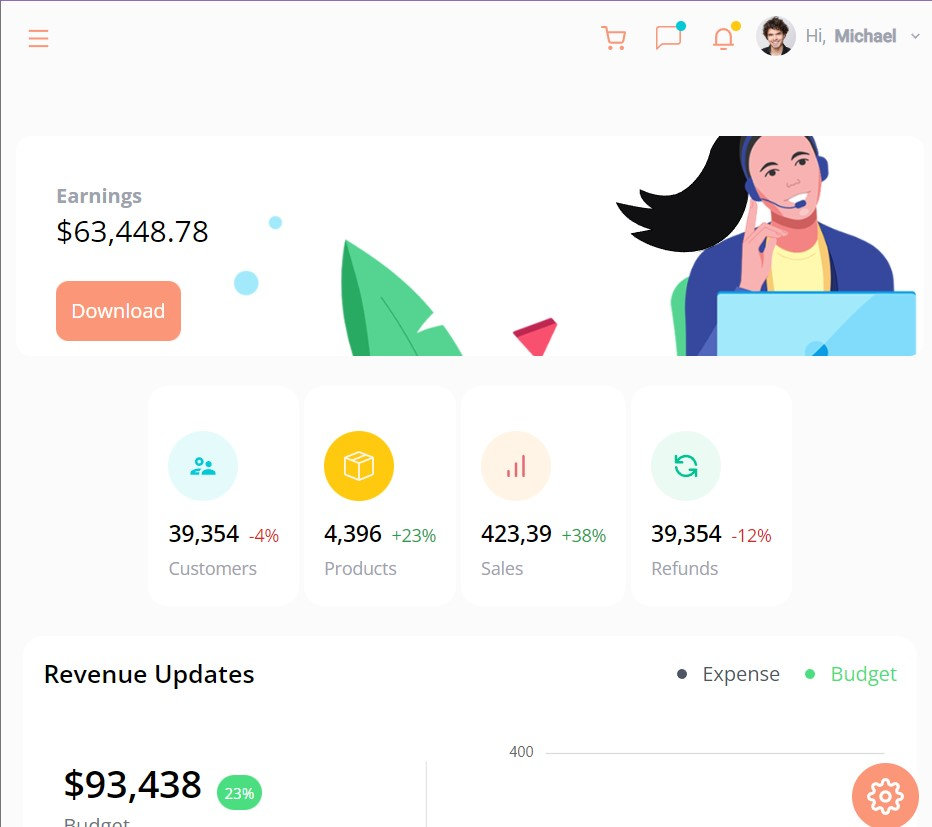

# React Dashboard

## Resources Used
Tutorial: (JS-Mastery Youtube channel)[https://www.youtube.com/watch?v=jx5hdo50a2M]
Component Library: (SyncFusion Components)[https://www.syncfusion.com/?utm_source=youtube&utm_medium=video&utm_campaign=syncfusion_javascriptmastery_yt]
React Component Library: (SyncFusion React Components)[https://www.syncfusion.com/react-components]

# Architecture

<!-- PROJECT LOGO -->
 

  

  <h3 align="center">Shoppy Dashboard</h3>

  

    React App showcasing SyncFusions components library created following a JS Mastery tutorial.
     
    <a href="https://www.syncfusion.com/?utm_source=youtube&utm_medium=video&utm_campaign=syncfusion_javascriptmastery_yt"><strong>Link to the Deployed Site »</strong></a>
     
     
    <a href="https://www.youtube.com/c/JavaScriptMastery">JS Mastery</a>
    ·
    <a href="https://www.syncfusion.com/?utm_source=youtube&utm_medium=video&utm_campaign=syncfusion_javascriptmastery_yt">SyncFusion</a>
    ·
    <a href="https://rneyrinck.github.io/Portfolio-2022/">My Portfolio</a>
  

<!-- TABLE OF CONTENTS -->

  
Table of Contents

  <ol>
    <li>
      <a href="#about-the-project">About The Project</a>
      <ul>
        <li><a href="#built-with">Built With</a></li>
      </ul>
    </li>
    <li>
      <a href="#getting-started">Getting Started</a>
      <ul>
        <li><a href="#prerequisites">Prerequisites</a></li>
        <li><a href="#installation">Installation</a></li>
      </ul>
    </li>
    <li><a href="#usage">Usage</a></li>
    <li><a href="#roadmap">Roadmap</a></li>
    <li><a href="#contributing">Contributing</a></li>
    <li><a href="#license">License</a></li>
    <li><a href="#contact">Contact</a></li>
    <li><a href="#acknowledgments">Acknowledgments</a></li>
  </ol>

<!-- ABOUT THE PROJECT -->
## About The Project

[![Product Name Screen Shot][product-screenshot]](https://example.com)

Dashboard application designed to showcase often-used functionalities wtihin dashboards, explore different tools for styling in React, and showcase to employers my ability to work on large scale, complex applications that are mobile friendly.

Whats cool about it:
* SyncFusion is awesome! Creating Kanban boards, drag and drop calendars, or complex data visualization usually takes forever, but SyncFusion let me utilize their cleverly built UI components to make show stopping components in a matter of moments instead of days.
* Most companies use some sort of internal tool with a dashboard functionality. This project allowed me to gain experience in quickly reaching MVP on a large scale projects. 
* The dashboard is only front-end at the moment but its clean code will make adding a backend simple.

Thanks for taking a look at the readme, if you have any questions please feel free to reach out through my portfolio!

(<a href="#readme-top">back to top</a>)

### Built With

This project was built using base code provided by JS Mastery - mainly placeholder content since there isn't a backend yet. SyncFusion is used as a component library with Material UI for styling.

* React.js
* SyncFusion
* Material UI

## REACT ARCHITECTURE

| Component     |                                              Description                                               |
| ------------- | :----------------------------------------------------------------------------------------------------: |
| App           |                                 This will render the react components                                  |
| components    |                   Houses all components in application for streamlined architecture                    |
| data and contexts         |             Holds often called snippets such as the API call, images, and placeholder URLS             |
| ChannelCard   |                Displays quick content for youtube Channel as card format in video feeds                |
| ChannelDetail |          Displays channel information including views, subscribers and all videos of channel           |
| Feed          | Displays videos either searched or tabbed to. Also displays sidebar component of different video types |
| NavBar        |                         Header with logo link to feed, and searchbar component                         |
| SearchBar     |                 Search for specific videos functionality leads to searchfeed component                 |
| SearchFeed    |                                Displays SearchBar results as video feed                                |
| SideBar       |                                   Displays video categories on feed                                    |
| VideoCard     |                             Displays video details in card format on feeds                             |
| VideoDetail   |                             Displays video with sidebar of related videos                              |
| Videos        |                                   Displays videos based on API calls                                   |

## Navigation

| **URL**                          | **HTTP Verb** | **Action** | **Description**          |
| -------------------------------- | ------------- | ---------- | ------------------------ |
| /                                | GET           | read       | view feed                |
| /video/:id                                | GET           | read       | view video detail                |
| /channel/:id                                | GET           | read       | view channel detail                |
| /search/:searchTerm                                | GET           | read       | view searched results in feed                |

(<a href="#readme-top">back to top</a>)

<!-- CONTRIBUTING -->
## Contributing

Contributions are what make the open source community such an amazing place to learn, inspire, and create. Any contributions you make are **greatly appreciated**.

If you have a suggestion that would make this better, please fork the repo and create a pull request. You can also simply open an issue with the tag "enhancement".
Don't forget to give the project a star! Thanks again!

1. Fork the Project
2. Create your Feature Branch (`git checkout -b feature/AmazingFeature`)
3. Commit your Changes (`git commit -m 'Add some AmazingFeature'`)
4. Push to the Branch (`git push origin feature/AmazingFeature`)
5. Open a Pull Request

(<a href="#readme-top">back to top</a>)

<!-- LICENSE -->
## License

Distributed under the MIT License. See `LICENSE.txt` for more information.

(<a href="#readme-top">back to top</a>)

<!-- CONTACT -->
## Contact

Your Name - [@your_twitter](https://twitter.com/your_username) - email@example.com

Project Link: [https://github.com/your_username/repo_name](https://github.com/your_username/repo_name)

(<a href="#readme-top">back to top</a>)

<!-- ACKNOWLEDGMENTS -->
## Acknowledgments

Use this space to list resources you find helpful and would like to give credit to. I've included a few of my favorites to kick things off!

* [Choose an Open Source License](https://choosealicense.com)
* [GitHub Emoji Cheat Sheet](https://www.webpagefx.com/tools/emoji-cheat-sheet)
* [Malven's Flexbox Cheatsheet](https://flexbox.malven.co/)
* [Malven's Grid Cheatsheet](https://grid.malven.co/)
* [Img Shields](https://shields.io)
* [GitHub Pages](https://pages.github.com)
* [Font Awesome](https://fontawesome.com)
* [React Icons](https://react-icons.github.io/react-icons/search)

(<a href="#readme-top">back to top</a>)

<!-- MARKDOWN LINKS & IMAGES -->
<!-- https://www.markdownguide.org/basic-syntax/#reference-style-links -->
[contributors-shield]: https://img.shields.io/github/contributors/othneildrew/Best-README-Template.svg?style=for-the-badge
[contributors-url]: https://github.com/othneildrew/Best-README-Template/graphs/contributors
[forks-shield]: https://img.shields.io/github/forks/othneildrew/Best-README-Template.svg?style=for-the-badge
[forks-url]: https://github.com/othneildrew/Best-README-Template/network/members
[stars-shield]: https://img.shields.io/github/stars/othneildrew/Best-README-Template.svg?style=for-the-badge
[stars-url]: https://github.com/othneildrew/Best-README-Template/stargazers
[issues-shield]: https://img.shields.io/github/issues/othneildrew/Best-README-Template.svg?style=for-the-badge
[issues-url]: https://github.com/othneildrew/Best-README-Template/issues
[license-shield]: https://img.shields.io/github/license/othneildrew/Best-README-Template.svg?style=for-the-badge
[license-url]: https://github.com/othneildrew/Best-README-Template/blob/master/LICENSE.txt
[linkedin-shield]: https://img.shields.io/badge/-LinkedIn-black.svg?style=for-the-badge&logo=linkedin&colorB=555
[linkedin-url]: https://linkedin.com/in/othneildrew
[product-screenshot]: images/screenshot.png
[Next.js]: https://img.shields.io/badge/next.js-000000?style=for-the-badge&logo=nextdotjs&logoColor=white
[Next-url]: https://nextjs.org/
[React.js]: https://img.shields.io/badge/React-20232A?style=for-the-badge&logo=react&logoColor=61DAFB
[React-url]: https://reactjs.org/
[Vue.js]: https://img.shields.io/badge/Vue.js-35495E?style=for-the-badge&logo=vuedotjs&logoColor=4FC08D
[Vue-url]: https://vuejs.org/
[Angular.io]: https://img.shields.io/badge/Angular-DD0031?style=for-the-badge&logo=angular&logoColor=white
[Angular-url]: https://angular.io/
[Svelte.dev]: https://img.shields.io/badge/Svelte-4A4A55?style=for-the-badge&logo=svelte&logoColor=FF3E00
[Svelte-url]: https://svelte.dev/
[Laravel.com]: https://img.shields.io/badge/Laravel-FF2D20?style=for-the-badge&logo=laravel&logoColor=white
[Laravel-url]: https://laravel.com
[Bootstrap.com]: https://img.shields.io/badge/Bootstrap-563D7C?style=for-the-badge&logo=bootstrap&logoColor=white
[Bootstrap-url]: https://getbootstrap.com
[JQuery.com]: https://img.shields.io/badge/jQuery-0769AD?style=for-the-badge&logo=jquery&logoColor=white
[JQuery-url]: https://jquery.com 
